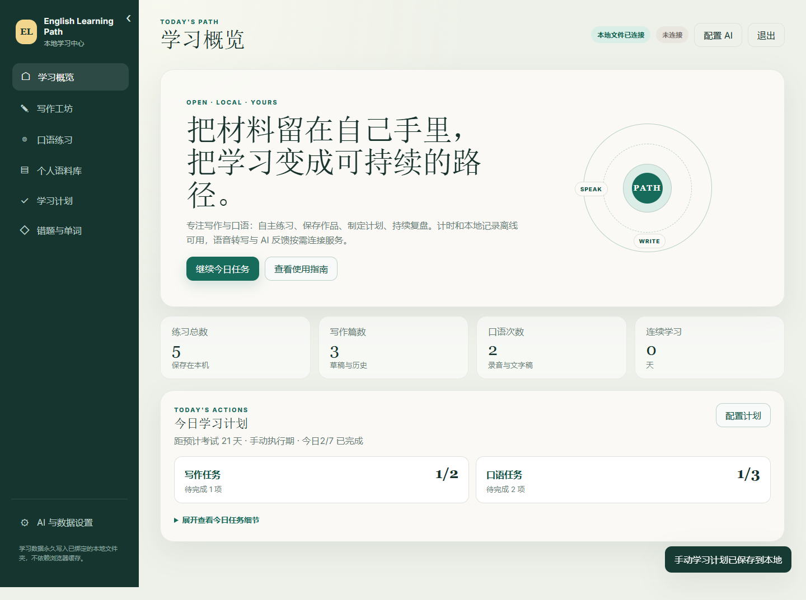
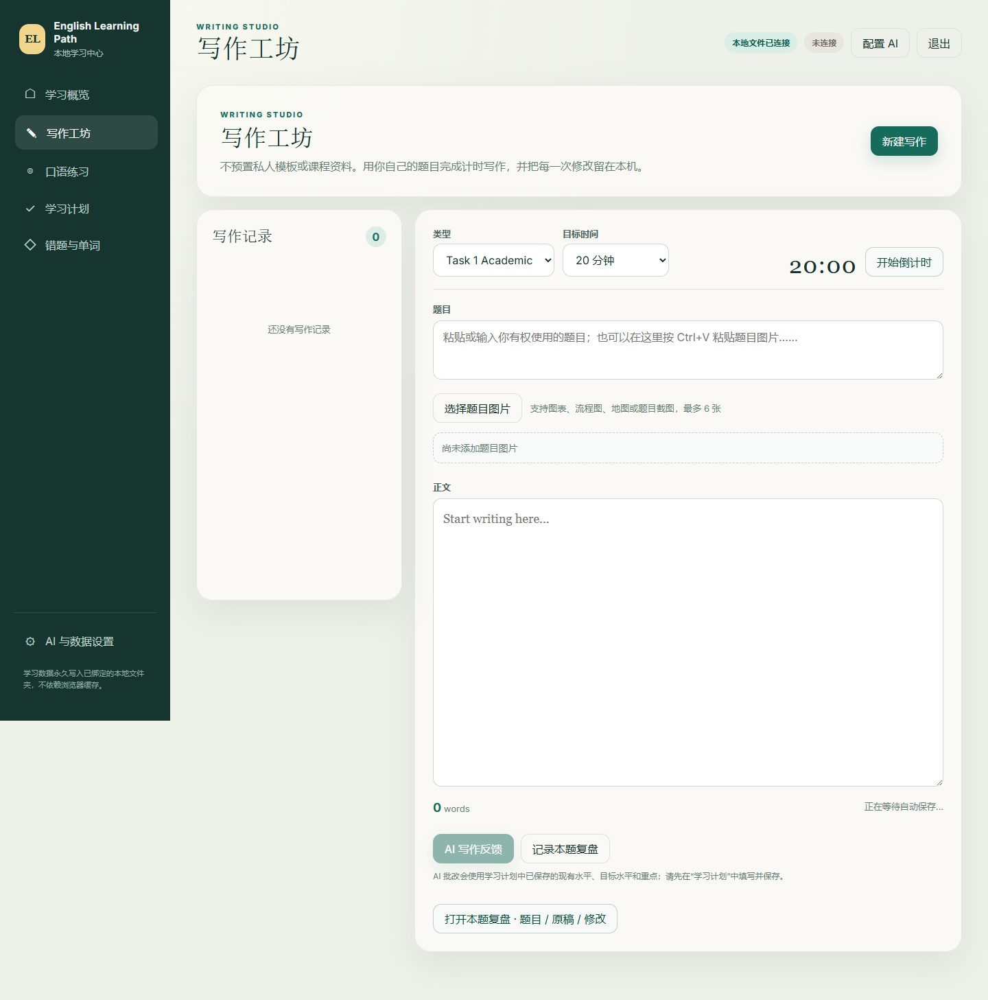
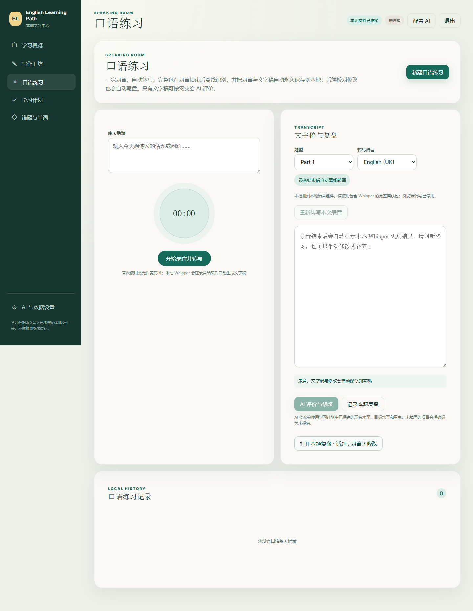
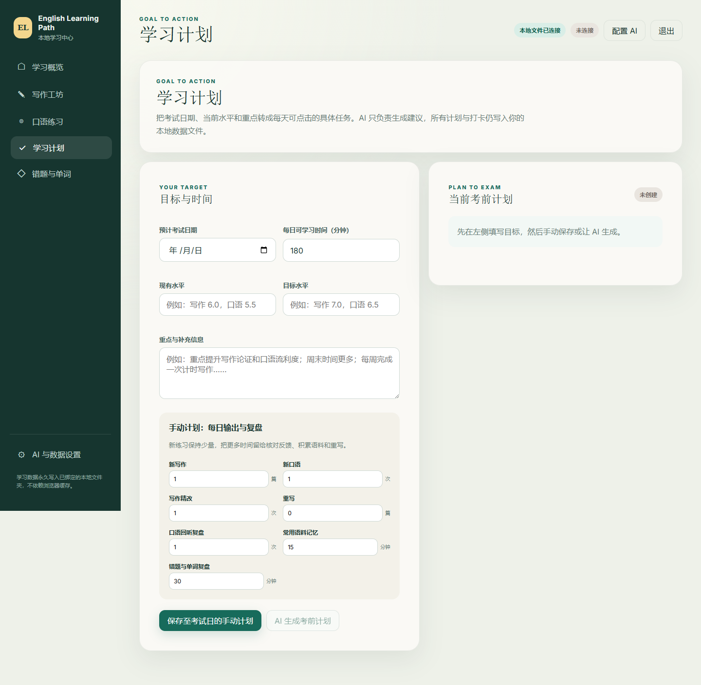
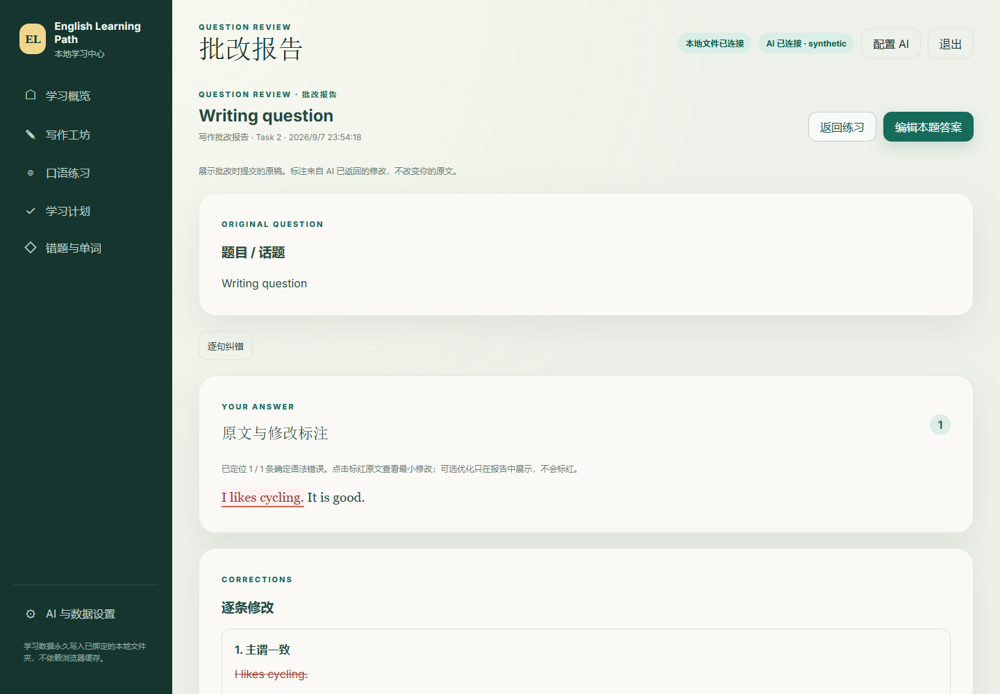

# English Learning Path · 英语学习路径

一个本地优先、内容由使用者掌控的开源英语学习中心。它专注于写作和口语练习，但**不附带商业题库、课程资料、受版权保护的录音或私人模板**。

## 普通使用者：下载即用

> 当前工作版本已聚焦写作与口语，尚未发布新的正式 Release；旧版 Release 可能仍包含原有模块。

1. 打开右侧 **Releases**；
2. 下载最新的 `EnglishLearnPath-Windows-x64-Full-版本号.zip`；
3. 完整解压 ZIP；
4. 双击 `启动学习中心.exe`，程序会在默认浏览器中打开。

不需要安装 Node.js、Python、数据库或其他依赖。请不要只下载绿色的 “Code → Download ZIP”，那是开发者源码，不含已经编译好的启动器。

第一次启动时，页面会先要求你**选择或创建一个永久数据文件夹**。完成选择后才会建立并显示主数据文件；程序不会预先显示开发者电脑的路径，也不会退回浏览器缓存。如果选择的是以前用过且包含 `EnglishLearnPath-data.json` 的文件夹，历史记录会自动载入。

每个解压目录都是相互隔离的便携副本。首次运行后，程序只在该副本旁创建 `runtime-data/config.json`，用于记住“这个副本绑定了哪个数据文件夹”；Release ZIP 和源码仓库均不包含该文件。同一台电脑重新下载并解压到新目录，也会从未绑定状态开始，不会读取另一个副本或开发环境的路径。学习记录始终写入你主动选择的数据文件夹。

> 当前便携包优先支持 Windows 10/11 x64。首次运行时，Windows 可能显示来自未知发布者的安全提示，因为开源版本暂未购买代码签名证书。

## 功能

- **写作**：自定义题目、计时、字数统计、本地历史与可选 AI 反馈；题目区支持选择图片或 Ctrl+V 粘贴图表、地图、流程图和截图，并随作文永久保存在本地；不内置私人模板或课程讲义。
- **口语**：完整包内置 whisper.cpp 和 Whisper small.en。一次录音结束后自动在本机离线转写，音频不上传、无需 API Key；可回听、校对并一起保存录音和文字稿，再按需调用文字 AI 批改。
- **永久数据**：题目、作文、练习记录和设置写入绑定文件夹中的 `EnglishLearnPath-data.json`，不使用浏览器缓存作为数据源。
- **AI**：计时、编辑与本地保存离线可用；高级反馈支持使用者自己的 OpenAI 兼容 API 或本地模型。
- **本题复盘**：写作、口语均有独立批改页面，集中查看题目、原稿、题图 / 已保存录音及 AI 修改。反馈支持 Markdown 标题、加粗、列表与表格；已保存的旧反馈也会自动排版。新批改保存提交时的原稿快照，不会被后续编辑覆盖。
- **原文标注与报告**：点击已批改记录进入报告页。写作只在原文中标红客观明确的语法、拼写或机械错误；措辞、自然度、简洁度、衔接和论证提升单独列为可选优化，不会把正确句子标错。点击标注可定位对应最小修改与原因；无法精确定位的建议保留在列表中。完整报告按标题分区并提供章节定位，标题不遮挡正文。可返回练习或编辑本题。记录以具体主题命名，题型作为辅助信息；查看旧报告不必再次请求 AI。
- **口语双稿**：原始转写原样展示；标点与大小写整理稿单独保存，修改标注显示在整理稿上。新口语批改一并生成，旧报告可点击 AI 整理按钮生成（会调用接口）。程序校验原词句没有被替换，整理失败不覆盖原稿。标注与修改卡片支持双向跳转；编辑答案时不重复显示旧报告正文。
- **学习计划**：填写预计考试日期、当前与目标水平、重点和每日时间；手动计划覆盖从创建当天到考试日，AI 计划会按剩余天数拆分基础、强化、冲刺和考前调整阶段。每天最多安排 1 篇新写作和 2 次新口语，并把写作精改、重写、口语回听重说、常用语料记忆与错题复盘拆成可执行任务，避免只堆新题。首页读取当天所在阶段并直接进入对应任务。
- **错题本与单词本**：写作、口语分别记录问题、原因和下次优化，并可单独积累单词、短语、释义、搭配和例句；支持 Ctrl+V 粘贴截图、删除记录及返回关联练习。

## 页面预览

以下图片来自当前写作与口语版本的实际页面，不是设计稿。












## AI 配置

写作与口语批改会一并使用“学习计划”中已保存的现有水平、目标水平及重点，让修改建议贴合当前能力、示范答案对齐目标。未填写时会注明未提供，不会擅自设定目标分数。

进入“AI 与数据设置”，先选择 DeepSeek、OpenAI、本地模型或自定义服务预设，再填写 API Key。预设会自动填写接口地址和建议模型，连接测试成功后 AI 按钮才会启用。

只有 DeepSeek API Key 时，选择 **DeepSeek** 即可：当前官方基础地址为 `https://api.deepseek.com`，页面建议使用 `deepseek-v4-flash`。模型名称可能变化，请以 DeepSeek 官方文档为准。

- 连接成功后，Key 和接口配置使用 Windows 当前账户加密，写入程序旁的 `runtime-data/ai-credentials.dpapi`；同一程序副本重启会自动恢复，不需再次输入。
- Key 不写入浏览器缓存、学习数据 JSON、导出备份或发布包。“断开并删除已保存配置”会移除本机密钥文件；更换电脑、Windows 账户或丢失该文件后需重新输入。
- 升级时保留自己的 `runtime-data` 目录，但不要把它上传或打包分享。加密不能防止已控制你 Windows 账户的恶意软件读取凭据。
- DeepSeek V4 的连接测试与正式批改默认使用非思考模式，避免思考预算耗尽而没有最终答案；正式反馈上限为 6000 token。
- 本地文字大模型需要使用者自行安装和启动；本地语音转写引擎和 small.en 模型已包含在 Full 完整包中，无需另外安装。
- 连接测试会发送一条极短请求，云端 API 可能收取极少量费用。

详见 [AI 配置说明](docs/AI_CONFIGURATION.md)。

## 练习内容

自行输入有权使用的写作题目（支持题图）和口语话题，不附带题库或私人课程资料。内容授权说明见 [版权边界](docs/CONTENT_GUIDE.md)。

如果还需要练习其他科目，可自行了解 **ZYZ 阅读**和**虾滑听力**，按作者最新公开说明获取并独立使用。这里只作名称提及；本项目不提供其题库、下载镜像、导入入口或适配，也与资料作者无隶属、授权或合作关系。

旧版本的其他模块入口与资源适配已移除。升级不会删除原数据文件中的旧字段或磁盘资源；这些旧内容不再展示或参与计划。可用设置中的导出功能保留完整备份。

## 隐私说明

学习记录永久写入你绑定的本地文件夹。程序每次覆盖主数据前保留滚动备份，并按天保留一份备份；清除浏览器缓存或更换浏览器不会删除记录。换电脑时复制整个数据文件夹，再在新电脑上重新绑定即可。

请只分享官方 Release ZIP 或从干净源码构建的 ZIP，不要把自己已经运行过的整个程序目录重新压缩分享；已运行副本的 `runtime-data/config.json` 会包含你选择的数据目录路径。删除这个小型配置目录只会重置文件夹绑定，不会删除绑定目录里的学习数据。

写作与口语都自动保存，不需要额外点击保存按钮：输入后会短暂防抖写盘；录音结束并完成 Whisper 转写后，音频与文字稿作为同一条记录自动写入本地数据文件，后续校对也会继续自动保存。刷新或重新启动后可从历史记录恢复，录音也可另行下载。单条音频最大 16 MB；音频不会发送给配置的文字 AI 接口。本地转写可取消或重试，失败时录音仍会保留。

写作切换到 Task 1（Academic / General）时默认 20 分钟，Task 2 默认 40 分钟。仍可手动调整时间；载入历史作文会保留该记录保存的计时设置。

当你主动使用 AI 反馈时，作文或口语文字稿会发送给你配置的服务商；录音不会发送到配置的文字 AI 接口。请自行阅读相关服务商的隐私政策。

## 开发与构建

前端位于 `app/`，使用原生 HTML/CSS/JavaScript，无 npm 运行时依赖。`launcher/` 是仅使用 Go 标准库的本地启动器、本地文件存储和 AI 代理。

开发者运行源码需要 Go 1.22+；构建完整包还需 CMake 与 Visual Studio 2022 C++ 构建工具（GitHub Actions 已提供）：

```powershell
go run ./launcher
```

构建 Windows 便携包：

```powershell
./build-portable.ps1 -Version dev
```

推送 `v*` 标签后，GitHub Actions 会自动生成 Release ZIP。普通使用者无需这些开发依赖。

## 项目边界与免责声明

English Learning Path 是独立的通用学习工具，与任何考试机构、出版社、培训机构或题库平台无隶属、授权或背书关系。项目不保证 AI 反馈、参考答案或学习建议的准确性，不能替代官方评分与专业教学。

请勿在 Issue、PR、备份或分支中上传你无权传播的题库、课程材料、录音、范文、API Key 或个人隐私数据。

## License

代码以 [GNU Affero General Public License v3.0](LICENSE) 发布。你可以学习、修改和再分发代码；如果基于本项目向网络用户提供修改版服务，也需要按许可证向这些用户提供对应源代码。第三方学习材料不因导入本工具而改变其原有版权与许可。

## 第三方版权与完整包

完整 ZIP 同时包含主程序、whisper.cpp CPU 引擎和约 466 MiB 的 Whisper small.en 英语模型，不需要用户再装 Python、FFmpeg、VC 运行库或下载模型。建议 4 GB 以上内存；本地转写最多 8 分钟/段，速度和准确性取决于设备与录音，请回听核对。

whisper.cpp 版权所有 **The ggml authors (2023–2026)**；Whisper 模型版权所有 **OpenAI (2022)**，均按 MIT 许可分发。格式转换模型来自 ggerganov/whisper.cpp。本项目不主张这些组件的原创版权。完整来源、版本与 SHA256 见 [第三方版权说明](THIRD_PARTY_NOTICES.md)，许可原文随完整包保留。
